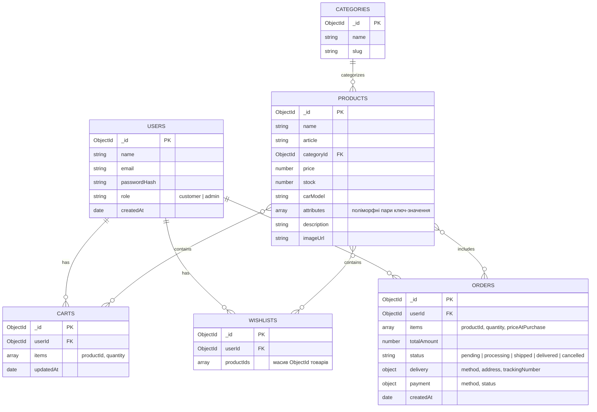

```markdown
# Технічна специфікація (Specification) — Інтернет-магазин автозапчастин

Цей документ описує оновлену архітектуру, модульну структуру, схему даних у MongoDB та ключові сценарії взаємодії для вебзастосунку інтернет-магазину автомобільних запчастин. Стек: **HTML, CSS, Vanilla JS, Node.js (native), MongoDB (native driver)**.

---

## 1. Архітектура, компоненти та модулі

Застосунок побудований на клієнт-серверній архітектурі без сторонніх бекенд-фреймворків. Маршрутизація та обробка запитів виконуються за допомогою нативного модуля `http` у Node.js, а робота з базою даних — через офіційний драйвер `mongodb`.

### Архітектурна схема:
```

[ Клієнт (HTML / CSS / Vanilla JS) ]
│ (HTTP / Fetch API)
▼
[ Сервер (Node.js HTTP Server + Auth / API Handlers) ]
│ (MongoDB Node.js Driver)
▼
[ База даних MongoDB ]

````

### Повна модульна структура проєкту:

```text
/
├── client/                     # Клієнтська частина
│   ├── index.html              # Головна сторінка каталогу
│   ├── product.html            # Детальна картка товару
│   ├── cart.html               # Кошик покупця
│   ├── wishlist.html           # Список бажаного (обране)
│   ├── auth.html               # Сторінка авторизації та реєстрації
│   ├── checkout.html           # Оформлення замовлення (доставка/оплата)
│   ├── admin.html              # Панель адміністратора (CRUD товарів)
│   ├── css/
│   │   └── style.css           # Загальні стилі інтерфейсу
│   └── js/
│       ├── api.js              # Модуль для виконання fetch-запитів до бекенду
│       ├── auth.js             # Логіка входу, реєстрації та перевірки токенів
│       ├── catalog.js          # Відображення каталогу та фільтрів
│       ├── productDetail.js    # Логіка картки товару та динамічних характеристик
│       ├── cart.js             # Логіка керування кошиком
│       ├── wishlist.js         # Логіка списку бажаного
│       ├── checkout.js         # Обробка даних доставки та оплати
│       └── admin.js            # Інтерфейс адміністратора
│
├── server/                     # Серверна частина (Node.js native)
│   ├── server.js               # Головна точка входу (http.createServer)
│   ├── db.js                   # Підключення до MongoDB та кешування клієнта
│   ├── controllers/            # Бізнес-логіка
│   │   ├── authController.js   # Хешування паролів, видача сесій/токенів
│   │   ├── productController.js# Обробка товарів та поліморфних атрибутів
│   │   ├── cartController.js   # Управління кошиком користувача
│   │   ├── wishlistController.js# Управління списком бажаного
│   │   └── orderController.js  # Створення замовлень, розрахунок доставки/оплати
│   └── routes/                 # Маршрутизатор (розподіл за URL та методами)
│       └── apiRouter.js        # Центральний маршрутизатор бекенду
│
├── package.json
└── spec.md

````

---

## 2. Структура даних та зв'язки (ER-діаграма MongoDB)

У MongoDB дані організовані у вигляді колекцій. Поліморфні характеристики (`attributes`) товарів реалізовані як вкладений масив або об'єкт ключ-значення, що дозволяє зберігати унікальні параметри для різних категорій запчастин (наприклад, ємність для акумуляторів, діаметр для гальмівних дисків).



---

## 3. Ключові сценарії та оновлення даних

### Сценарій 1: Авторизація (`auth.html` + `authController.js`)

1. **Клієнт:** Користувач вводить email та пароль на `auth.html`. `auth.js` відправляє POST-запит на `/api/auth/login`.
2. **Сервер:** `authController.js` шукає користувача в колекції `users`, порівнює хеш пароля. У разі успіху генерує токен сесії та повертає його клієнту.
3. **Клієнт:** Зберігає токен у `localStorage` та перенаправляє користувача на головну сторінку або в особистий кабінет.

### Сценарій 2: Перегляд картки товару (`product.html` + поліморфні характеристики)

1. **Клієнт:** Користувач клікає на товар у каталозі, відкривається `product.html?id=...`. Скрипт `productDetail.js` надсилає GET-запит на `/api/products/:id`.
2. **Сервер:** Отримує документ з колекції `products`, який містить стандартні поля та гнучке поле `attributes` (наприклад, `[{key: "Вольтаж", value: "12V"}, {key: "Ємність", value: "60Ah"}]`).
3. **Клієнт:** Динамічно рендерить як загальні відомості, так і таблицю поліморфних характеристик залежно від категорії товару.

### Сценарій 3: Оформлення замовлення (`checkout.html` + розрахунок доставки та оплати)

1. **Клієнт:** Користувач переходить до оформлення замовлення з кошика (`cart.html`), обирає тип доставки (наприклад, «Нова Пошта», відділення №5) та спосіб оплати («Картою онлайн» або «Накладений платіж»).
2. **Клієнт:** Надсилає POST-запит на `/api/orders` із масивом товарів, об'єктом `delivery` та об'єктом `payment`.
3. **Сервер (`orderController.js`):**

- Перевіряє наявність товарів на складі (`stock`).
- Створює новий документ у колекції `orders` із фіксацією статусів оплати та деталей доставки.
- Атомарно оновлює залишки у колекції `products` (зменшує `stock`).
- Очищає активний кошик користувача в колекції `carts`.

4. **Клієнт:** Отримує підтвердження замовлення та перенаправляється на сторінку успішної оплати/оформлення.

### Сценарій 4: Адмін-CRUD товарів (`admin.html` + `productController.js`)

1. **Клієнт:** Адміністратор у панелі управління заповнює форму створення товару, включаючи динамічні атрибути, та надсилає POST-запит на `/api/admin/products`.
2. **Сервер:** Перевіряє права доступу користувача за роллю у токені. За допомогою нативного драйвера MongoDB виконує `insertOne()` у колекцію `products`.
3. **База даних:** Зберігає новий документ із заданою структурою.
4. **Клієнт:** Отримує оновлений список товарів через GET-запит і відображає його в адміністративній таблиці в реальному часі.

```

```
